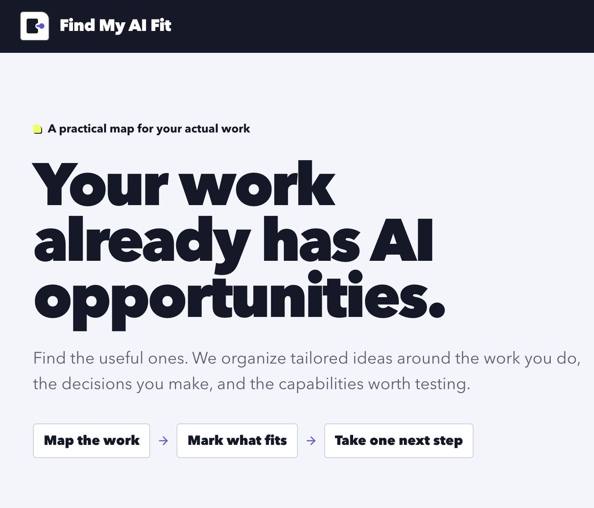
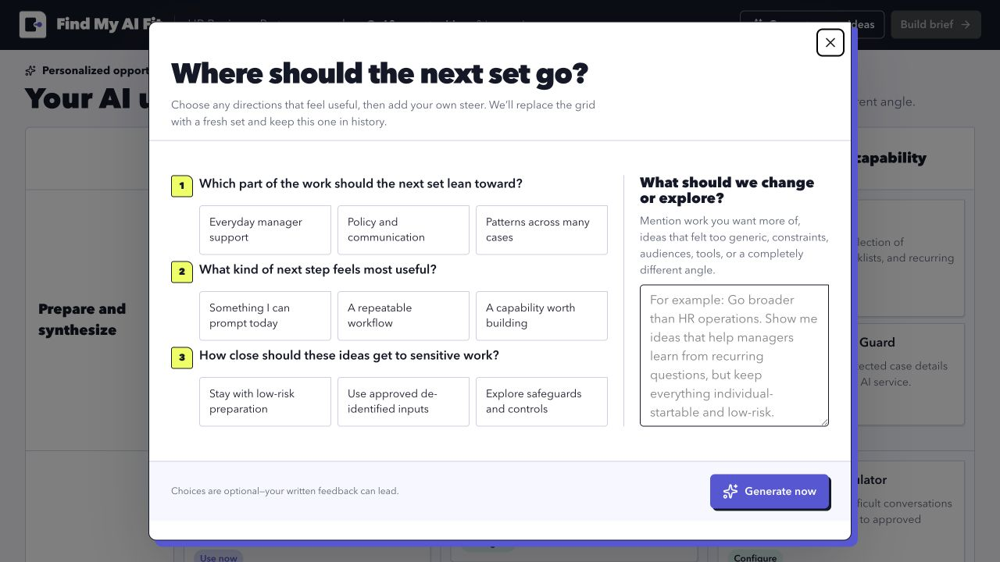

# Find My AI Fit

Find My AI Fit turns a LinkedIn PDF or another resume into a structured map of practical AI opportunities. The goal is not to produce the longest possible AI report. It is to help someone find a few ideas that fit their actual work, mark the useful ones, and leave with one small experiment they can try.

- Product site: [FindMyAIFit.com](https://findmyaifit.com)
- Public source: [github.com/byronwall/finy-my-ai-fit](https://github.com/byronwall/finy-my-ai-fit)



## How the product works

1. **Start with real context.** Drop a LinkedIn PDF or another resume up to 10 MB. The included HR business partner example works without uploading a document.
2. **Review the read.** The first model call separates supported profile facts from cautious inferences and proposes nine directions. The user can choose any number of them or continue with a broad scan.
3. **Scan the opportunity map.** The app generates 18 individual-startable use cases across a 3 × 3 grid:
   - Prepare and synthesize
   - Deliver and communicate
   - Review and improve
   - Do work faster
   - Make better decisions
   - Create a new capability
4. **Mark what fits.** Each card is a simple “Interesting” choice. The grid is intentionally closer to a checklist than a project-management workspace.
5. **Ask for a different angle when needed.** “Generate more ideas” asks two or three useful questions, accepts free-form direction, creates a fresh set, and keeps earlier sets in history. Selections carry across every set.
6. **End with a practical plan.** The final brief recommends one starting point, defines a bounded first experiment, explains the selected tasks, and produces one ready-to-copy prompt for each idea.



The interface went through several rounds of subtraction. Earlier versions included save, hide, inspect, and per-cell deepening actions. Those controls were individually reasonable but made the grid feel like the product. The current flow keeps the grid useful and puts the emphasis on the plan that comes out of it:

```text
resume
  -> grounded directions
  -> opportunity map
  -> mark what fits
  -> one practical plan
```

## Stack

- [SolidStart](https://start.solidjs.com/) and SolidJS
- TypeScript
- Panda CSS with shared Park UI / Ark UI wrappers
- Vercel AI SDK with the OpenAI Responses API
- Zod schemas for every model and JSON boundary
- File-backed JSON workflow sessions and generation records
- Vitest and ESLint
- Docker Compose deployment with a persistent `/app/data` volume

The default model is `gpt-5.6-terra`. Model calls stay on the server and request structured, schema-validated output.

## Run locally

Requires Node.js 22+ and pnpm 11.

```bash
cp app/.env.example app/.env
# Set OPENAI_API_KEY in app/.env
pnpm -C app install
pnpm -C app dev
```

Open [http://localhost:3000](http://localhost:3000).

The HR example is available without an OpenAI request. Personalized profile analysis, fresh idea generation, and live brief synthesis require `OPENAI_API_KEY`.

Useful commands:

```bash
pnpm -C app verify
pnpm -C app type-check
pnpm -C app test
pnpm -C app lint
pnpm -C app build
```

`pnpm -C app verify` is the normal quality gate. It runs type checks, tests, and lint.

## Configuration

The full environment contract lives in [`app/.env.example`](app/.env.example).

| Variable | Purpose |
| --- | --- |
| `OPENAI_API_KEY` | Required for personalized AI generation |
| `OPENAI_MODEL` | Model ID; defaults to `gpt-5.6-terra` |
| `APP_DATA_DIR` | File-backed runtime data directory; defaults to `app/data` |
| `APP_BASE_URL` | Public application URL outside Coolify |
| `BASE_PATH` | Optional deployment subpath |
| `ADMIN_PASSWORD` | Required password for `/admin`; rotating it invalidates existing admin cookies |
| `SUPER_USER_EMAIL` | Admin identity used by the reusable account scaffold |
| `EMAIL_DELIVERY`, `RESEND_API_KEY`, `EMAIL_FROM` | Optional magic-link email delivery |
| `STRIPE_*` | Optional credit-pack billing scaffold |

The AI use-case workflow itself does not send email and does not require Stripe.

## Durable sessions, generation records, and privacy

Personalized work receives stable, directly addressable routes:

```text
/sessions/<session-id>/review
/sessions/<session-id>/ideas/<round-id>
/sessions/<session-id>/brief
```

The current profile, chosen directions, every idea round, selections, pending operation, and generated brief are stored under:

```text
APP_DATA_DIR/use-case-sessions/<uuid>.json
```

Refreshing or reopening one of these routes restores the saved workflow. A new idea round receives its route before generation starts, so an interrupted request can also recover into its pending, completed, or failed state.

Every model execution creates a UUID-addressed JSON record under:

```text
APP_DATA_DIR/generations/<uuid>.json
```

Records capture the generation kind, model, prompt inputs, normalized output, provider metadata, token usage, timing, and errors. Pending, completed, and failed attempts are all retained so prompt and model behavior can be inspected later.

The raw PDF is sent to the configured OpenAI model for the active profile-analysis request. OpenAI response storage is disabled with `store: false`. The application replaces the PDF body with a redacted marker before writing its local generation trace; it does not save the uploaded file itself.

The structured profile extracted from that document, chosen directions, subsequent prompts, generated results, and selections are part of the file-backed session and generation history. Do not use real sensitive employment, medical, financial, or otherwise confidential material in an unsecured deployment.

The password-protected usage dashboard and generation inspector are available at:

```text
/admin
/admin/generations
```

`/admin` summarizes persisted request traffic, visitors, errors, paths, and product
events. A successful `ADMIN_PASSWORD` sign-in creates a signed 30-day HttpOnly
cookie. Analytics data is retained under `APP_DATA_DIR/analytics/store.json`;
generation records can be opened individually by UUID.

## Docker

Compose expects a repository-root `.env`. The easiest starting point is:

```bash
cp app/.env.example .env
# Set OPENAI_API_KEY, ADMIN_PASSWORD, and SUPER_USER_EMAIL
docker compose up --build
```

`docker-compose.yml` mounts a named volume at `/app/data`, preserving generation records and other file-backed runtime state across container replacements.

## Repository map

- `app/` — SolidStart application, server routes, UI, tests, and deployment source
- `app/src/features/use-case-grid/` — the product flow and domain schemas
- `app/src/features/use-case-grid/session-store.ts` — UUID-addressed workflow-session persistence
- `app/src/routes/sessions/` — refresh-safe profile, idea-round, and brief routes
- `app/src/lib/ai/generation-store.ts` — UUID-addressed generation persistence
- `app/src/features/admin-analytics/` — protected usage dashboard and event ledger
- `app/src/routes/admin/generations/` — generation history and detail views
- `ai-use-case-grid/` — original product brief, jobs-to-be-done inventory, grid model, backlog, example content, and mockups
- `brainstorming-tool-and-ai-use-case-generator-with-hierarchical-grid-ui.md` — the original 50-minute dictation transcript
- `PRODUCT.md` and `DESIGN.md` — product and visual-system context
- `docs/manual-browser-verification.md` — task-oriented browser checks
- `tmp/evals/` — local browser-evaluation evidence; intentionally git-ignored

## Origin

The project started with a long dictation about two related ideas: a general brainstorming interface and a hosted AI use-case generator. The first implementation preserved too much of the broad brainstorming system. The useful boundary turned out to be smaller: organize enough breadth to help someone choose, then stop exploring and produce a concrete next action.

The original thinking and preserved backlog remain in [`ai-use-case-grid/`](ai-use-case-grid/README.md). They include broader hierarchical-grid and brainstorming ideas that do not need to fit inside this application.
