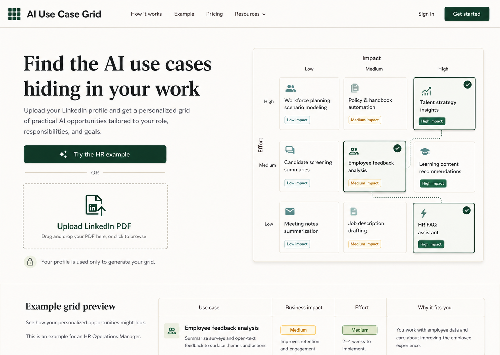
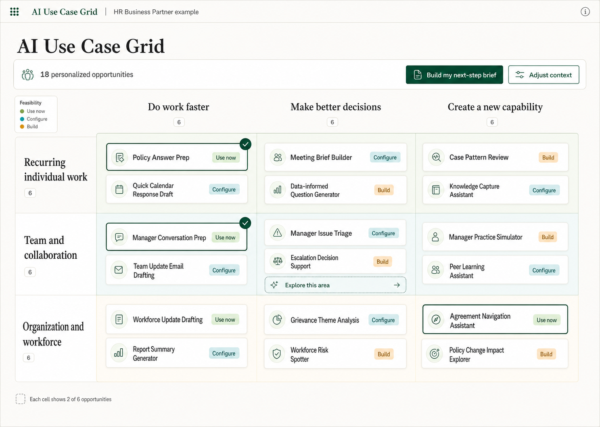
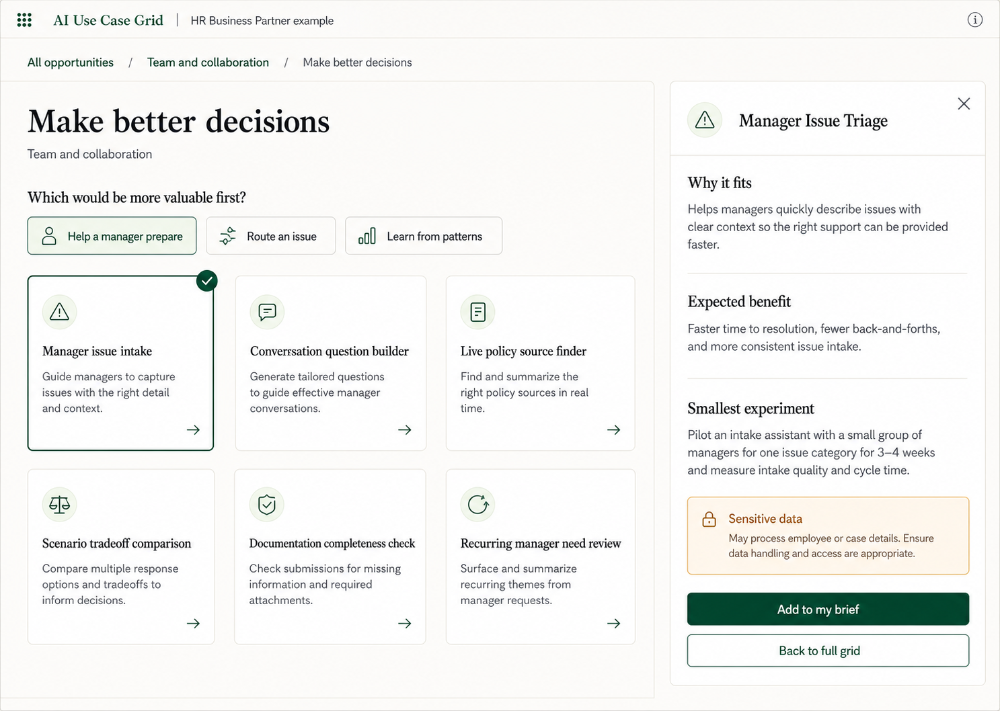
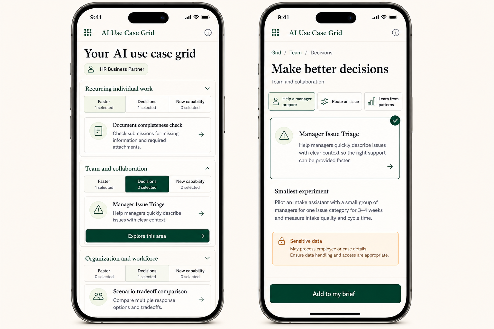

# UI Mockups

These mockups translate the product documents into one consistent visual direction. They were generated with the built-in image generation tool and are concept references rather than pixel-accurate implementation specifications.

## Visual direction

- Warm ivory canvas with charcoal text
- Deep forest-green actions and selection state
- Pale sage regions with restrained teal and amber status chips
- Editorial serif display headings paired with a clear sans-serif UI face
- Fine warm-gray borders, soft shadows, and compact information density
- No generic AI imagery; the value is communicated through structured work

## Screens

### 1. Landing and upload

Establishes the product promise, an immediate example path, LinkedIn PDF upload, privacy reassurance, and a preview of the grid.

### 2. Desktop results grid

Tests whether the two axes, compact cards, feasibility levels, selections, and cell-level exploration can coexist in one scannable workspace.

### 3. Focused cell and selected detail

Shows the transition from the full map to a higher-intent region. Breadcrumbs preserve location; one useful question guides refinement; the detail panel exposes fit, benefit, experiment, and sensitivity without creating a long report.

### 4. Mobile responsive flow

Avoids shrinking the desktop matrix. Rows become stacked sections and the three column meanings remain available as tabs inside each section. The second phone shows the focused continuation.

## Implementation notes

- Treat the images as interaction and art-direction references, not sources of final copy.
- Use the canonical use-case content in [`../05-real-example-content.md`](../05-real-example-content.md). Image generation introduced a few alternate card labels in the desktop matrix.
- The landing mockup uses an impact × effort preview for immediate visual familiarity; the actual generated result should use the work-area × value-type axes defined in [`../02-live-site-mvp.md`](../02-live-site-mvp.md).
- The mobile approach is the strongest responsive candidate to prototype: stacked row groups, persistent column tabs, and a focused detail route.
- Preserve the visible sensitive-data notice at the individual-use-case level instead of relying only on a global disclaimer.

## Generation prompt set

All four images used the `ui-mockup` taxonomy.

### Landing

> Create a high-fidelity desktop website mockup for “AI Use Case Grid,” a professional tool that turns a LinkedIn profile into a personalized map of practical AI opportunities. Use a warm ivory editorial SaaS aesthetic, forest-green actions, a two-column hero with the headline “Find the AI use cases hiding in your work,” clear “Try the HR example” and “Upload LinkedIn PDF” paths, privacy reassurance, and a visible miniature 3 × 3 opportunity grid. Avoid generic AI imagery, gradients, glassmorphism, and excessive whitespace.

### Desktop grid

> Create a high-fidelity desktop results workspace for the HR business-partner example. Make the 3 × 3 matrix the dominant surface. Columns are “Do work faster,” “Make better decisions,” and “Create a new capability.” Rows are “Recurring individual work,” “Team and collaboration,” and “Organization and workforce.” Show compact named suggestion cards, feasibility chips, two selected ideas, a summary strip, “Build my next-step brief,” and one “Explore this area” affordance. Use the same warm ivory and forest-green editorial system.

### Focused cell

> Using the desktop grid as a style reference, create the next state for “Team and collaboration × Make better decisions.” Preserve a breadcrumb to the full grid. Show six narrower ideas, one useful refinement question, and a persistent detail panel for “Manager Issue Triage” with “Why it fits,” “Expected benefit,” “Smallest experiment,” a visible “Sensitive data” notice, and “Add to my brief.” Communicate increasing specificity without visual clutter.

### Mobile flow

> Using the focused screen as a style reference, create two responsive mobile states. Do not squeeze the 3 × 3 matrix onto a phone. On the overview, turn rows into stacked sections and retain “Faster,” “Decisions,” and “New capability” as tabs with selected counts. On the focused screen, show “Grid / Team / Decisions,” “Manager Issue Triage,” a smallest experiment, sensitive-data warning, and sticky “Add to my brief” action. Keep touch targets large and both phones fully visible.

