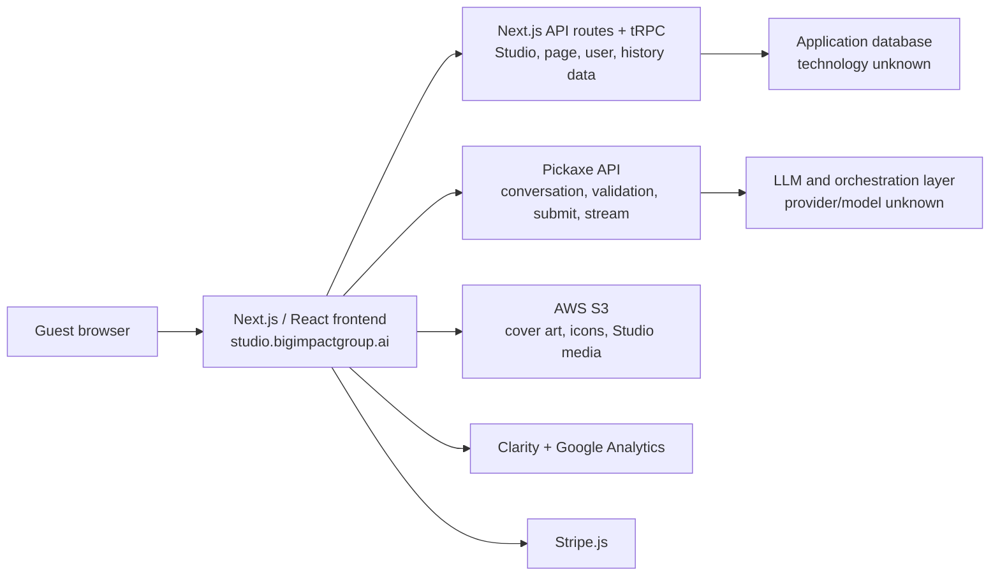

# Studio BiG / FAST! Use Case Generator: likely tech stack

Observed on **2026-07-22** at `studio.bigimpactgroup.ai/guest/3SOVV7UCHP8` in Chrome. This is a black-box assessment of the deployed application, not a source-code audit. Confidence labels reflect how directly the live site exposed each technology.

## Executive summary

The site appears to be a **white-labeled Pickaxe Studio application** rather than a custom AI product built entirely by Studio BiG. Studio BiG supplies the branding, navigation, agent configuration, prompt content, and hosted assets; the underlying application and conversation infrastructure are served by Pickaxe domains and APIs.

The clearest stack is:

- **React + Next.js Pages Router**, rendered through a server-side catch-all route
- **Tailwind CSS 3-style utility output** with custom theme variables and component styling
- **tRPC** for Studio/user/page data
- **NextAuth/Auth.js-compatible session handling** (likely, but not conclusively identified)
- A separate **Pickaxe API** for access validation, conversations, response submission, streamed responses, users, and conversation titles
- **AWS S3** for Studio and agent media assets
- **Stripe** for commerce/subscription functionality
- **Microsoft Clarity** and **Google Analytics** for analytics
- Likely deployment on **Vercel**, though the hosting provider was not directly confirmed

The actual LLM provider, model, database, queue, vector store, and internal orchestration framework are not exposed by the browser and should be treated as unknown.

## What I exercised

I followed the guest chatbot flow through two turns:

1. Started with the requested role, company, and company URL.
2. Received five tailored AI use cases.
3. Asked for ideas at the intersection of data visualization and agentic pipelines.
4. Received five more targeted ideas with formatted headings and explanatory text.

The interaction persisted under a `sessionId`, updated the conversation title, rendered Markdown-like rich text, and used a dedicated response-stream endpoint. The composer also exposes file attachment and microphone controls.

## Evidence-backed stack assessment

| Layer | Likely technology | Confidence | Direct evidence from the live site |
|---|---|---:|---|
| Product/platform | Pickaxe Studio / Pickaxe | Very high | Runtime calls went to `pickaxe-api2.pickaxe.co` and `studio-api2.pickaxe.co`; media used `prod-pickaxe-assets.s3.us-west-2.amazonaws.com`; UI/API resource names include `pickaxeId`, `studioId`, and `pickaxe.get.*`. |
| Frontend framework | React | Very high | Next.js framework/runtime chunks and a hydrated `#__next` application root were present. |
| Web framework | Next.js, Pages Router | Very high | `/_next/static/...` assets, `__NEXT_DATA__`, page route `/[[...route]]`, Pages Router chunks, and `gssp: true` were directly visible. |
| Rendering strategy | Server-side rendering via `getServerSideProps` | Very high | `__NEXT_DATA__` reported `__N_SSP`/`gssp: true` for the catch-all page. |
| Styling | Tailwind CSS, probably v3 generation | Very high | DOM classes include `flex`, `gap-2`, `rounded-full`, responsive arbitrary variants, and other Tailwind utilities. The compiled stylesheet contains Tailwind's `--tw-*` variables and the `tailwindcss` marker. Exact package version was not exposed. |
| Component layer | Custom components, possibly influenced by shadcn/Radix patterns | Low to medium | Focus-ring and button utility patterns resemble shadcn-style components, but no decisive Radix or shadcn signature was found. This should not be treated as confirmed. |
| Typed API layer | tRPC | Very high | Numerous calls used `/api/trpc/...`, including batched procedures such as `studio.get.page`, `studio.get.studio`, `user.get.user`, and `pickaxe.get.history`. |
| Application language | TypeScript | Medium to high | tRPC and the modern Next.js structure make TypeScript very likely, but compiled production assets do not prove the source language. |
| Server runtime | Node.js and/or Vercel serverless functions | Medium | Next.js Pages Router, tRPC, and `/api/*` routes strongly suggest a Node-compatible runtime. A serverless or edge split remains possible. |
| Hosting/deployment | Vercel | Medium to high | Next.js asset URLs carried deployment parameters shaped like `dpl=dpl_...`, a strong Vercel fingerprint. Response headers were not inspected, so this is not definitive. |
| Authentication | NextAuth/Auth.js or a compatible endpoint | Medium to high | The application requested `/api/auth/session`. The endpoint convention strongly matches NextAuth/Auth.js, but another implementation could mimic it. |
| Conversation backend | Pickaxe API service | Very high | Observed endpoints included `/conversation`, `/response/submit`, `/response/stream/{id}`, `/conversation/title`, `/access/validate`, and `/user` on `pickaxe-api2.pickaxe.co`. |
| Streaming | Streamed HTTP response delivery | High | The browser used a dedicated `/response/stream/{id}` resource after submitting a response. The exact transport—SSE versus another fetch-stream implementation—was not proven. |
| Asset storage | Amazon S3, `us-west-2` | Very high | Cover photos, chat icons, Studio imagery, and social images loaded directly from `prod-pickaxe-assets.s3.us-west-2.amazonaws.com`. |
| Payments | Stripe.js | Very high | `https://js.stripe.com/basil/stripe.js` and Stripe's embedded outer frame loaded on the guest page. This indicates Stripe integration at the platform level, even though the tested flow did not enter checkout. |
| Product analytics | Microsoft Clarity | Very high | `https://www.clarity.ms/tag/xcb44exz9c` loaded. |
| Web analytics | Google Analytics / gtag | Very high | `gtag.js` loaded with measurement ID `G-KVMQGZ1PH4`. |
| Fonts | Mulish plus locally bundled fonts | High | Google Fonts loaded Mulish; the Next.js build also preloaded multiple locally bundled `.ttf` files. Another observed font request included Rajdhani. |
| Media/input | Browser file upload and microphone UI | High | The composer contains a multi-file input covering documents, spreadsheets, presentations, Markdown/HTML/XML, audio, video, and images, plus a microphone control. Backend handling was not exercised. |

## Likely architecture

## Frontend details

The deployed bundle uses the older, established **Next.js Pages Router** rather than the App Router. Its public route is implemented as an optional catch-all page, `/[[...route]]`, and the guest view is server-rendered before React hydrates it. That arrangement lets the same codebase handle Studio home pages, guest agent routes, and other portal content through a single routing shell.

The interface is heavily utility-styled. Tailwind classes cover layout, spacing, responsive behavior, transitions, focus rings, arbitrary values, and custom CSS variables such as `--portal-roundness`. A custom `glass` class and portal-level variables suggest that Pickaxe exposes a theme layer for each customer's white-label Studio.

The chat output uses custom classes including `pxe-markdown` and `pxe-prose`, indicating a platform-specific rich-text/Markdown presentation layer. The underlying Markdown library could be `react-markdown`, unified/remark, or something else; the live build did not expose enough evidence to choose one.

## API and data-flow details

Two backend surfaces are visible:

1. **Same-origin Next.js/tRPC APIs** at `studio.bigimpactgroup.ai/api/trpc/...` handle Studio configuration, pages, users, offer links, access groups, documents/memory status, and conversation history metadata.
2. **Cross-origin Pickaxe APIs** at `pickaxe-api2.pickaxe.co` and `studio-api2.pickaxe.co` handle the active agent, Studio identity, access validation, conversations, response submission, streaming, user information, and generated conversation titles.

This split suggests the Next.js application acts as the customer-facing portal and typed application backend, while Pickaxe's dedicated API service owns model execution and conversational state. It is plausible that both surfaces share internal data stores, but the browser does not establish that.

The second assistant turn arrived through a response-stream resource, consistent with token or chunk streaming. Once the response completed, the interface showed rich formatted content and refreshed history/title data through tRPC.

## What cannot be determined responsibly

The deployed client does **not** provide reliable evidence for the following:

- Which model provider is used: OpenAI, Anthropic, Google, or another provider
- The exact model name or whether routing/fallbacks are used
- The agent orchestration library or workflow engine
- Whether web research is performed by a built-in search tool, retrieval system, or model knowledge
- Database technology (Postgres, MySQL, DynamoDB, MongoDB, etc.)
- Vector database or embedding provider
- Cache, job queue, or event bus
- Infrastructure behind the Pickaxe API
- Exact versions of Next.js, React, Tailwind, tRPC, or NextAuth/Auth.js
- Whether response streaming uses Server-Sent Events specifically

Any claim about those components would be speculation without source access, source maps, response headers, or server-side documentation.

## Bottom line

For practical comparison or reimplementation, the closest visible blueprint is:

> A server-rendered React application built with Next.js Pages Router and Tailwind, using tRPC for typed portal APIs, a separate streaming AI conversation service, S3-hosted white-label assets, session-based guest histories, Stripe for monetization, and Clarity/Google Analytics for telemetry.

The distinctive business logic—the agent prompt, role/company intake flow, use-case taxonomy, and Studio BiG branding—appears to sit on top of Pickaxe's hosted product infrastructure.
